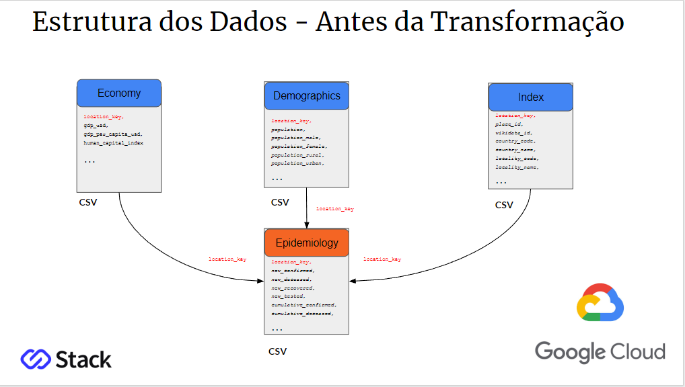
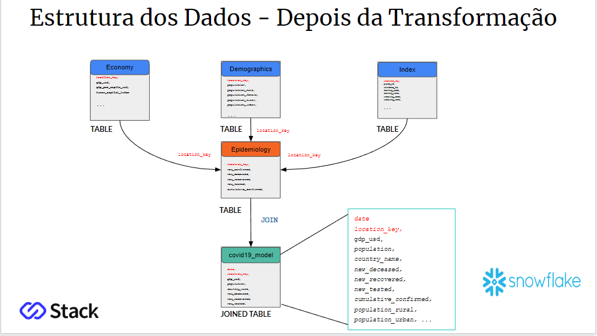
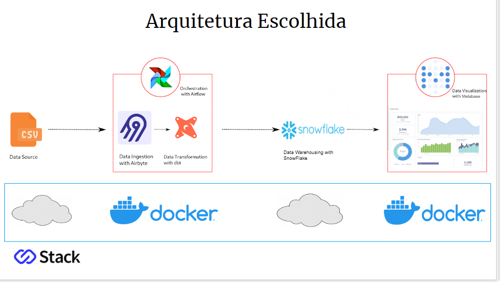
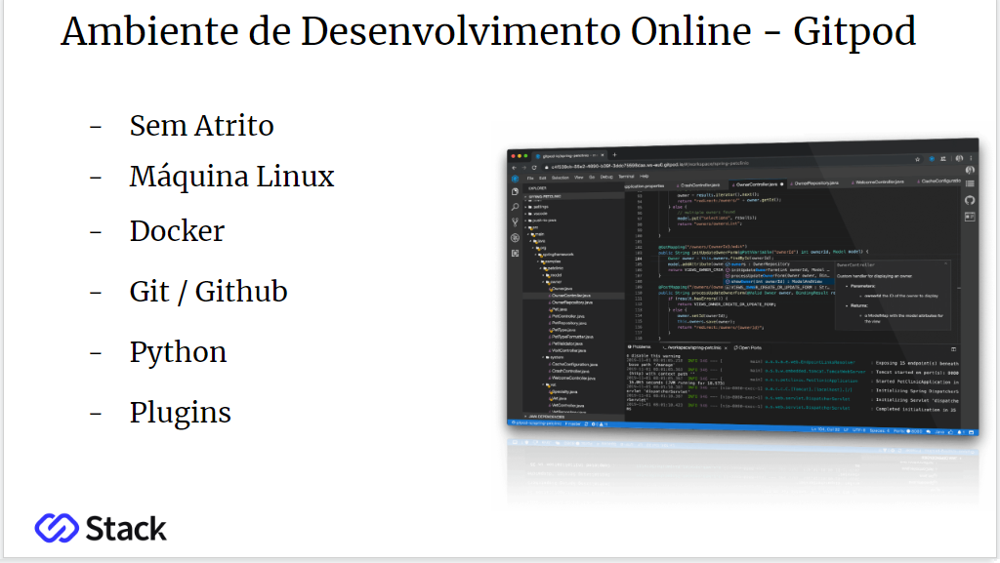

# Modern Data Stack Pipeline

O objetivo desse projeto foi criar um pipeline de dados para extrair informações de uma base de dados pública acerca dos casos de COVID19 no mundo.

## Fonte de Dados:
  - Link para os Datasets Utilizados: https://health.google.com/covid-19/open-data/raw-data

## Para este projeto, foram usados as seguintes tecnologias: 

- **Gitpod**: Para criar ambiente de desenvolvimento e subir os containers
- **Docker**: Para criação dos containers
- **Airflow**: Para realizar a tarefa de orquestrar o pipeline
- **Airbyte**: Para conexão na fonte e destino dos dados para ingestão
- **DBT**: Para criação de modelo de processamento e transformação dos dados em SQL
- **Snowflake**: Para criação de um Data Warehouse e armazenamento dos dados
- **Metabase**: Para exploração dos dados e criação de dashboards

## Os componentes foram organizados na seguinte arquitetura:

## Links uteis:

- **Link para os Datasets Utilizados**: https://health.google.com/covid-19/open-data/raw-data
- **Repositório da Aplicação**: https://github.com/moderndatastackpipeline/modern-data-stack
- **Repositório do Airbyte**: https://github.com/moderndatastackpipeline/airbyte
- **Repositório do Dbt**: https://github.com/moderndatastackpipeline/dbt-model
- **Ambiente de Desenvolvimento**: https://www.gitpod.io/
- **Documentação do Airbyte**: https://airbytehq.github.io/
- **Documentação do Airflow**: https://airflow.apache.org/docs/
- **Documentação do Dbt**: https://docs.getdbt.com/
- **Documentação do Snowflake**: https://docs.snowflake.com/en/
- **Docucentação do Metabase**: https://www.metabase.com/docs/latest/
